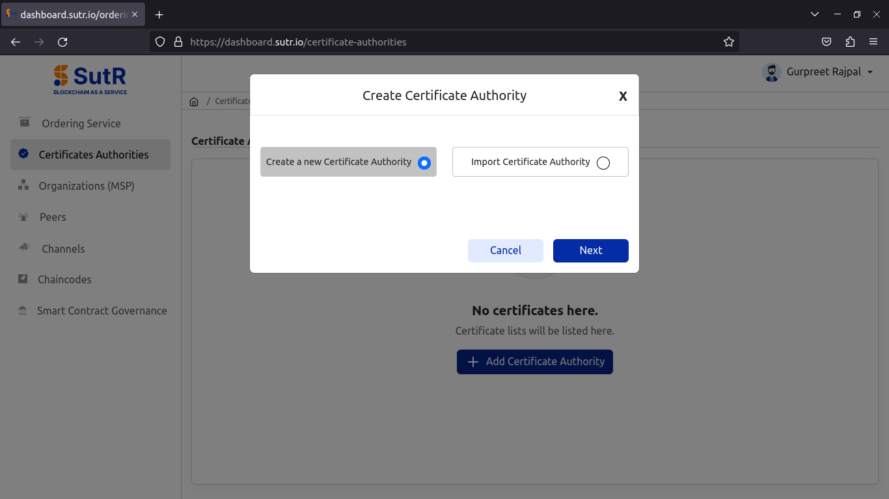
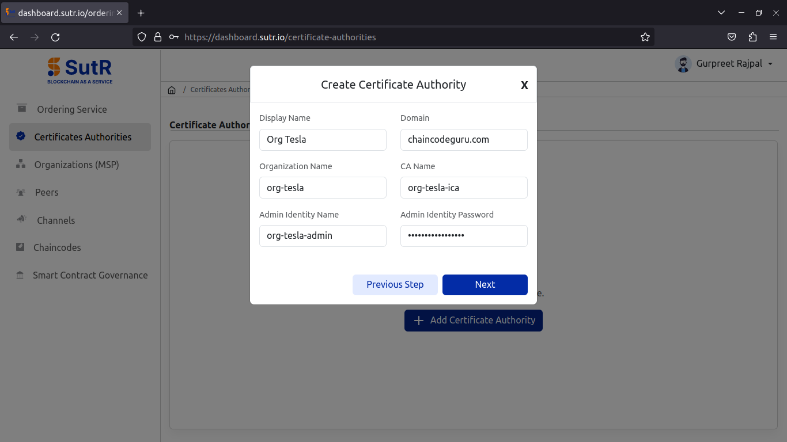
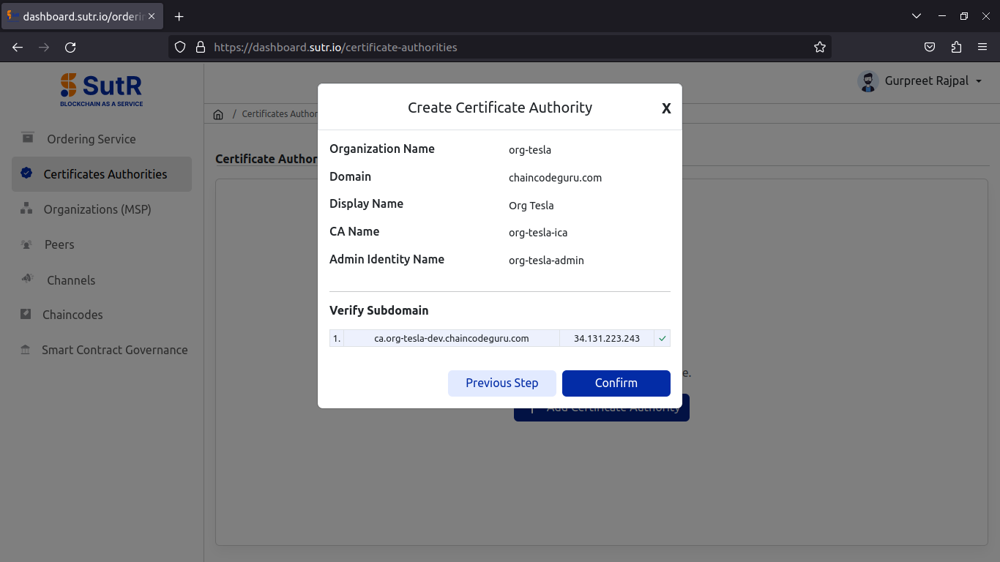
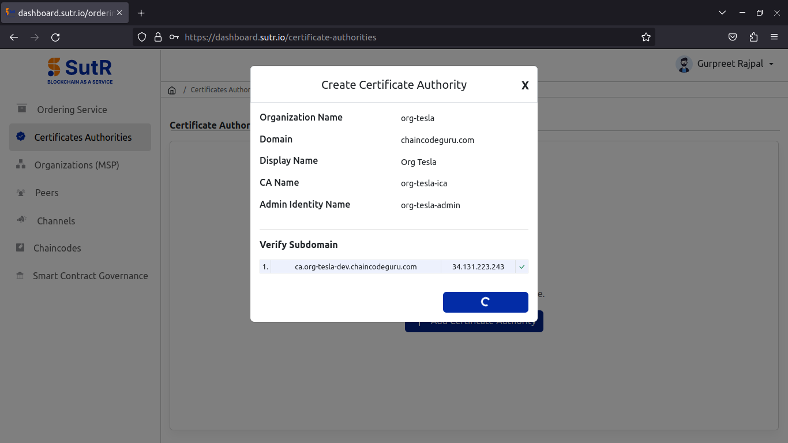
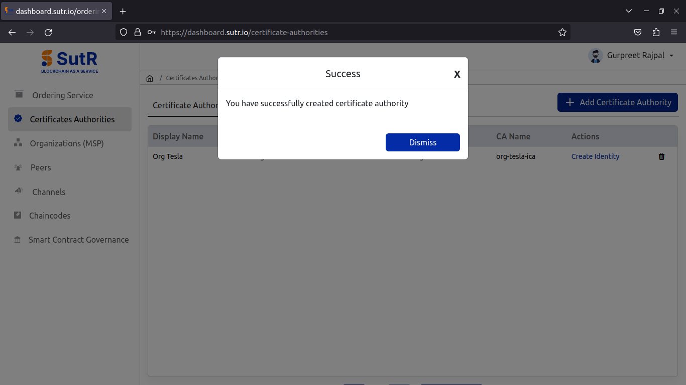
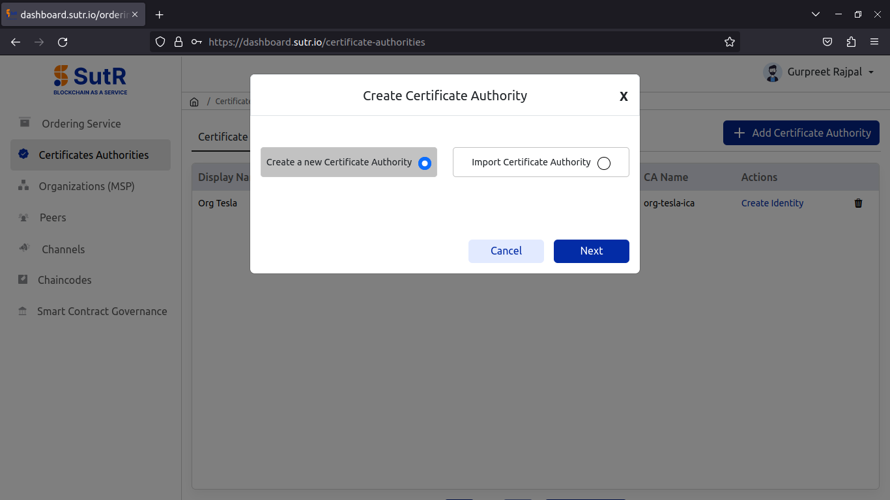
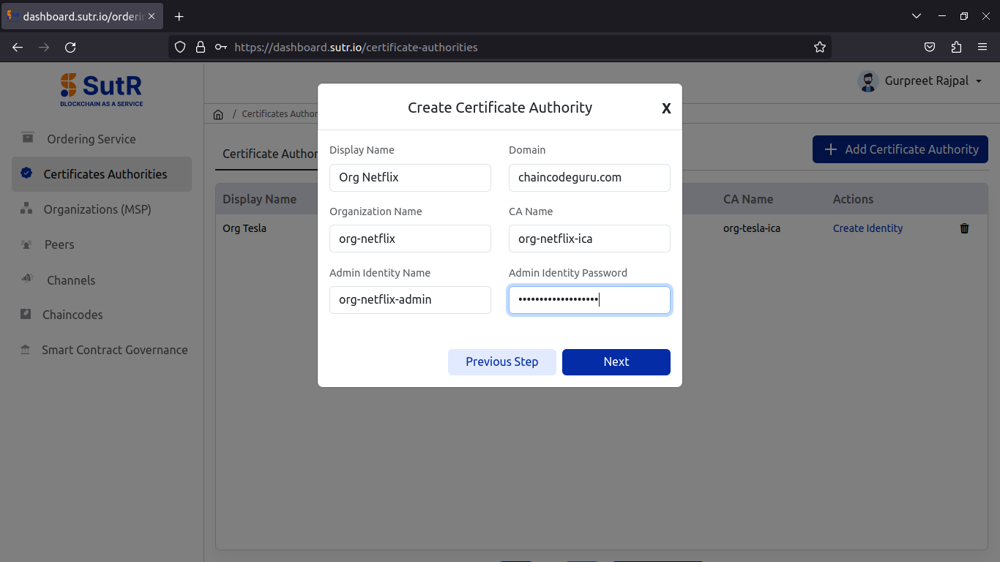

# Certificate Authorities

## Org-Tesla

### Create CA

Let’s begin with creating certificate authority to initiate the creation of peer org. Click on Add Certificate Authority. 

It will show a prompt asking for two options, whether to create a new CA (or) To import CA. Select to create new CA and click on Next. 

For creating new CA, you will need to fill the following inputs.  

1) Display Name – Peer Org CA display name.  
2) Domain – Domain to be used with peer endpoints.  
3) Organization Name – Name of Peer Org.  
4) CA Name – Name of Peer Org CA.  
5) Admin Identity Name – Name of Org Admin Identity.  
6) Admin Identity Password – Password of Org Admin Identity.  

Fill in and click on Next. 

It will then verify if CA subdomain is pointed to IP or not. Click on Confirm. 

Once the CA creation is done, you will receive the success prompt like below. 

Under the Register Identity tab in CA module, you will see the list of identities registered to the CA which includes a peer, org user and org admin. 

## Org-Netflix

### Create CA

Follow all steps from creating CA till adding peer to create the second peer org. 

