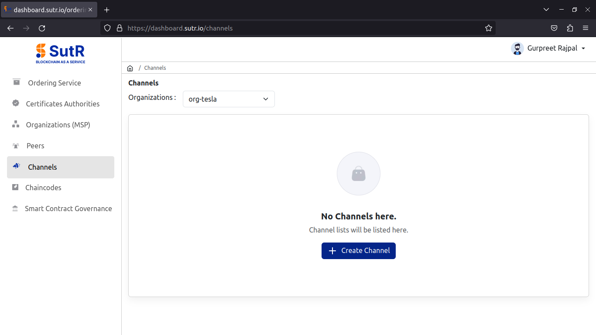
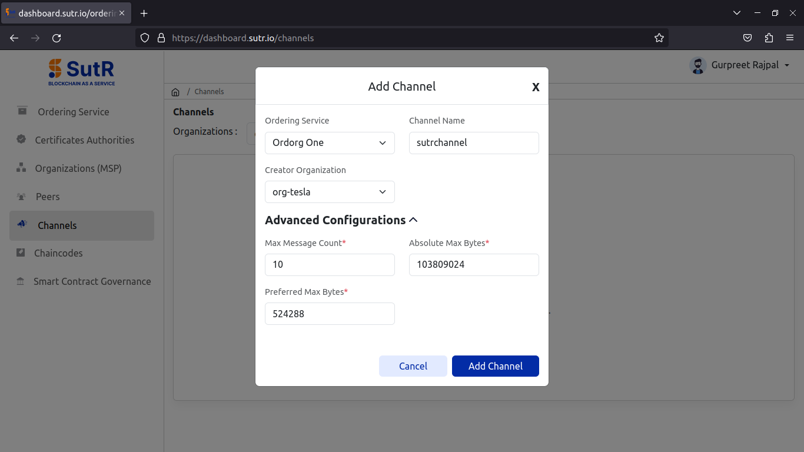
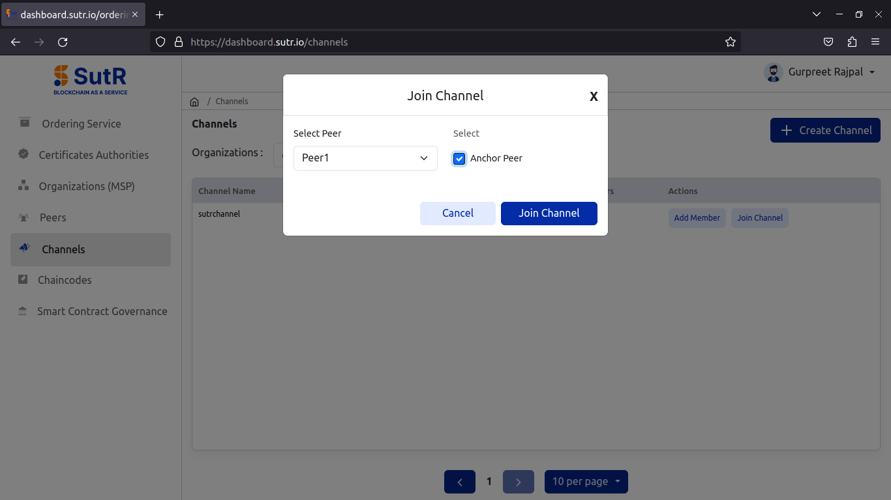
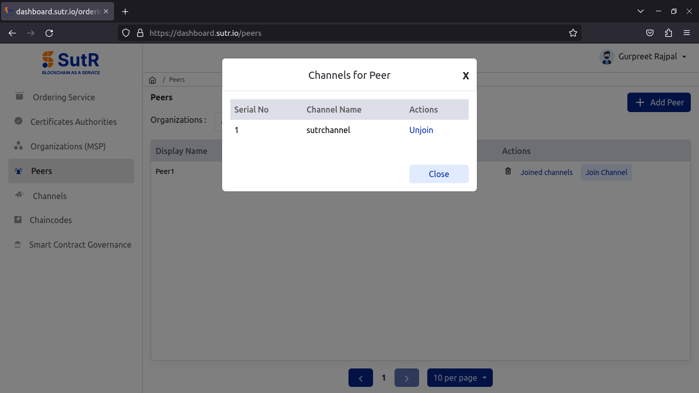
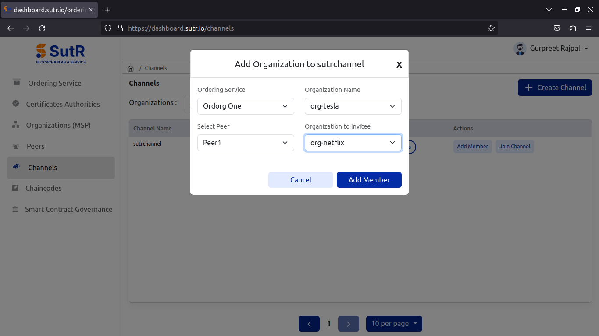
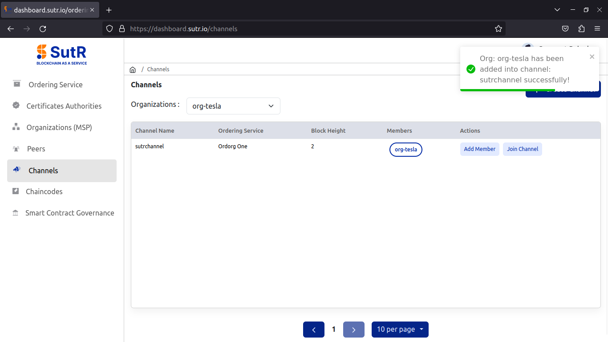
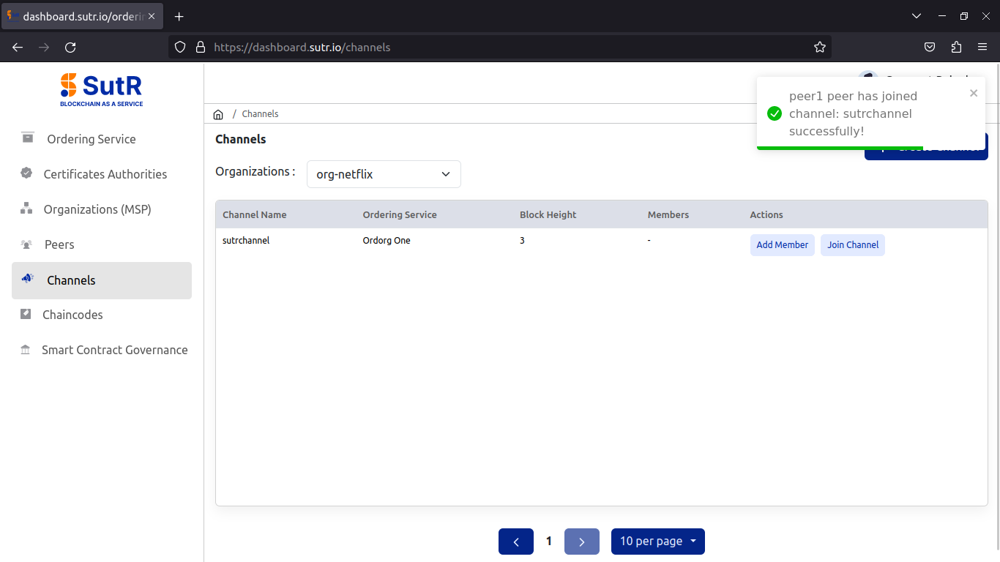

# Create Channel: 

To create a new channel, click on Create channel under the Channels module. 

Provide the necessary details for channel configuration and click on Add Channel. 

1) Ordering Service – Select orderer org from Dropdown.  
2) Channel Name – Name of channel to be created.  
3) Creator Organization – Select an org which will be used to create the org.  
4) Advanced configurations will have fields like max message count, absolute max bytes and preferred max bytes. Those fields are already filled with default values, update it if needed.  

Once filled all the details, click on Add Channel. 

You will see the channel creation is done successfully. 

Now, add peers to the channel. Click on join channel, select peer id and select anchor peer checkbox. Next, click on Join Channel. 

You will see a prompt saying that peer has joined channel successfully. 

Under the peers module, select the org from the drop down, click on Joined channels and you will see a prompt saying which channel the peer has joined to. 

To add second org to the channel, using the first org or the org which you used to create the channel, invite the other org. Click on Add Member. 

You will see a message saying that the other org has joined the channel.

Now, add the peer of second org to the channel.

