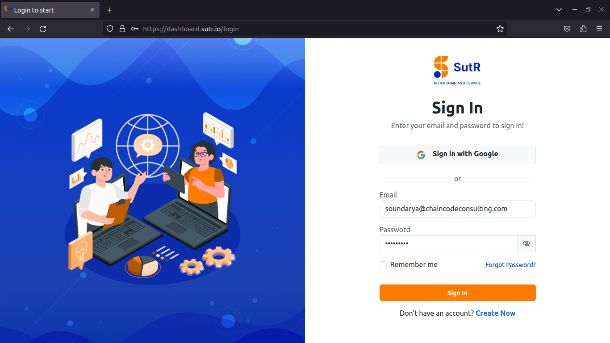

# Login

SutR Dashboard allows users to build Hyperledger Fabric network quickly with simple steps. 

In this manual we will create a Hyperledger Fabric network with one orderer org with 3 nodes and two peer orgs with one node each.

## Orderer Organization

    * ordorg-one 

## Peer Organization

    * org-tesla 

    * org-netflix 

Login to SutR dashboard under the url https://dashboard.sutr.io with your credentials. Click on Sign In. 

