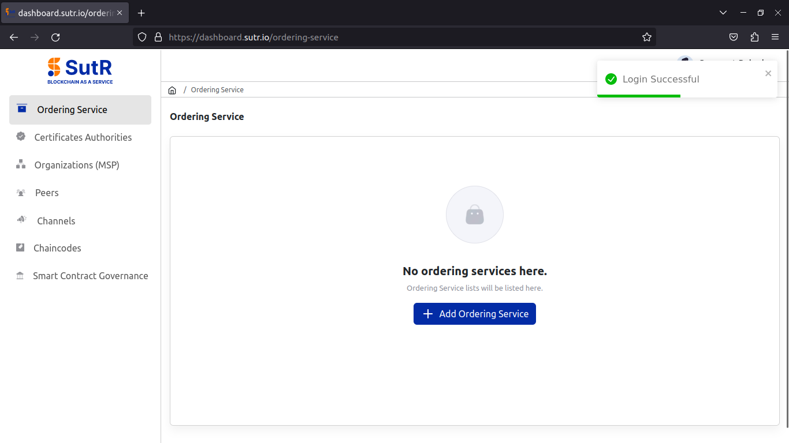
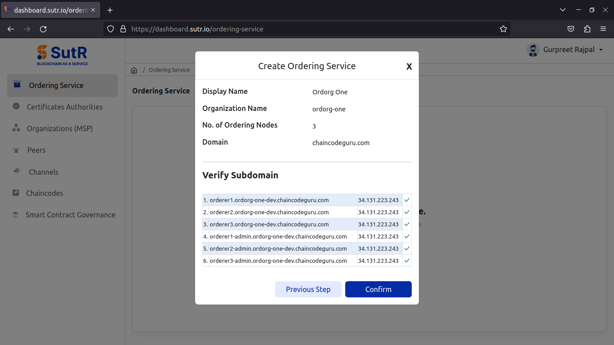
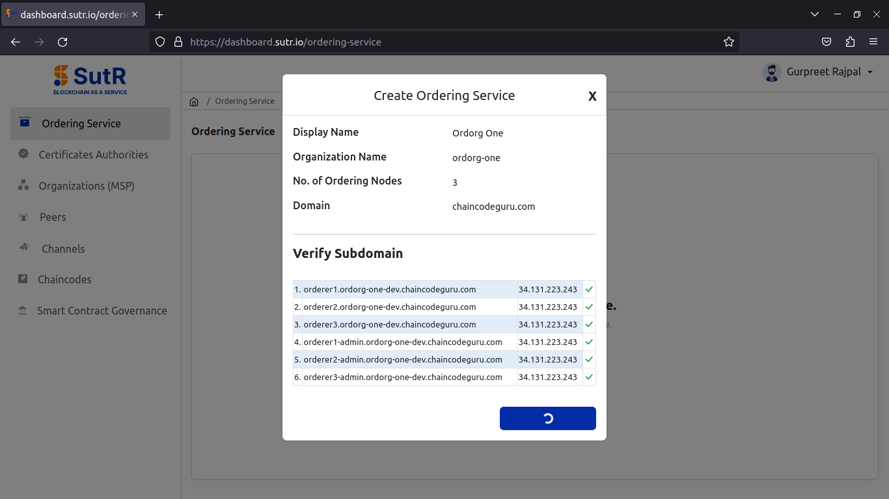
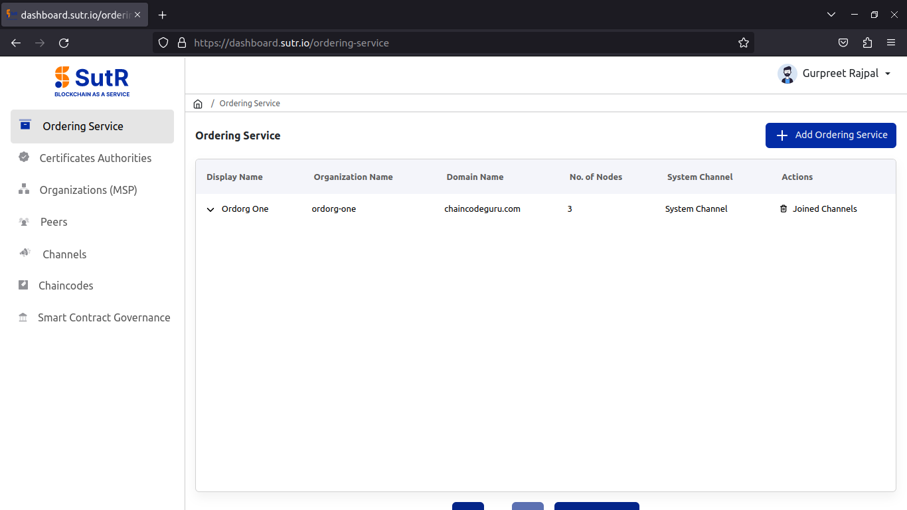

# Ordering Service

The ordering service module in SutR dashboard will enable users to create orderer org with a defined number of nodes. 

Click on "Add Ordering Service". 

Next, you will get a prompt asking to fill the required inputs to create the ordering org. The inputs include below, 

1) Ordering org display name  
2) Orderer org name  
3) No. Of Ordering nodes – As a best practice we can create an ordering service with either 3 or 5 nodes.  
4) Channel Name – It is optional for fabric v2.5  
5) Domain to be used with ordering endpoints  
6) Advanced configurations like max message count, absolute max bytes and preferred max bytes.  

Explanation of these fields you can find below, 

* Max Message Count: Maximum number of messages allowed in a block before it triggers block creation. 
* Absolute Max Bytes: Hard limit on block size in bytes, triggering block creation when reached. 
* Preferred Max Bytes: Soft limit for an optimal block size in bytes but can exceed if needed up to other limits. 

Once filled in the inputs, click on Next. 

It will then verify if the subdomains are pointed to the Ingress IP. So, it is required to point domains before starting to create the network. If you receive all the domains with green tick marks, Click on Confirm. 

You will see the ordering service started to create. 

Once it is created, you will see the list below. 

