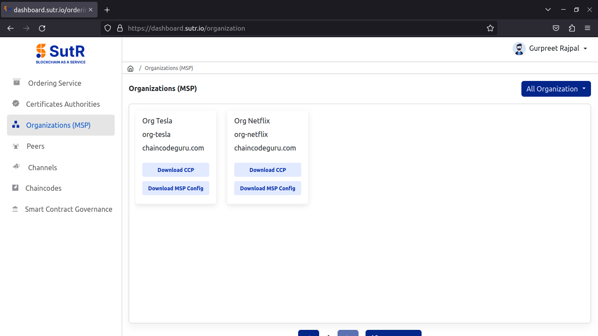

# Organizations (MSP)

Under the organizations tab, you will see the peer orgs you’ve created. And it will allow you to download CCP and MSP configuration of the org. 

## CCP (Connection Configuration Profile): 

-> The CCP file, typically a YAML or JSON file, contains details about the network's structure, including peer and orderer addresses, channels, and certificates, to facilitate client applications connecting to the Fabric network.  

-> It is used by client applications to identify and connect to specific resources within the Fabric network, such as peers and orderers, belonging to different organizations.  

## MSP (Membership Service Provider): 

-> MSP configuration defines identity and access control for the organization, including certificates, signing keys, and CA (Certificate Authority) details, which are essential for verifying the legitimacy and roles of network participants.  

-> MSP ensures that each participant’s identity is authenticated and authorized according to network policies, governing who can participate in transactions and access resources.  

 