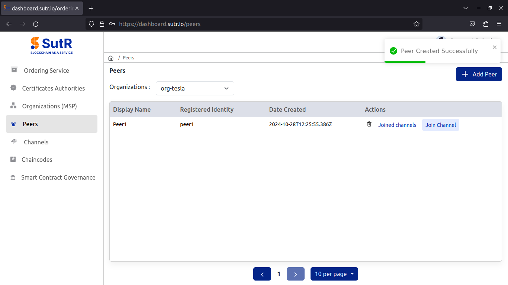

# Peers

## Org-Tesla

### Add Peers

Next, go to Peers module and click on “Add peer”.

For adding new peer, you will need to fill in the following inputs.  

1) Organization – Select peer org name from the dropdown.  
2) Organization Domain – Domain to be used with peer endpoints.  
3) Display Name – Peer ID.  
4) Choose Registered Identity – Select registered peer id from dropdown.  

Fill in and click on Next. 

Next page will verify the subdomains, then click on Confirm. 

Once the peer is created successfully, you will see a prompt saying it. 

## Org-Netflix

Follow all steps from creating CA till adding peer to create the second peer org. 

Next page will verify the subdomains, then click on Confirm, which will start deploying the peer.

